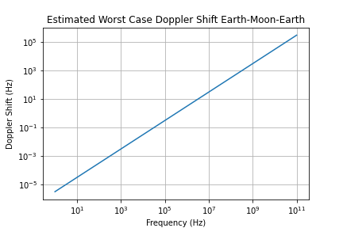
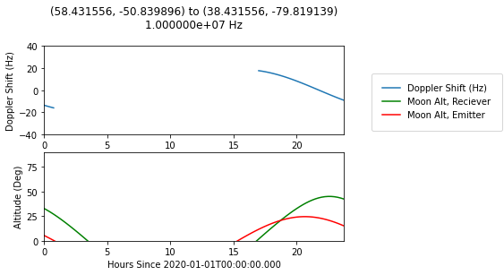

# kohls-seti
# Earth-Moon-Earth Doppler Factor Predictions
Mason Kohls, Berkeley SETI Research Center, Spring 2020

## Introduction
One method for determining Earth's technosignature is to examine the radio waves reflected by the moon back towards the Earth. Radio signals emitted from the Earth and reflected off the Moon are subject to two doppler shifts: when the Moon 'bounces' the signal and when it is recieved on Earth. In this project I generate predictions for the doppler factor for arbitrary emitter and reciever locations on Earth.
## Background
The doppler shift as described in the reciever frame is . 
Consider the a signal being emitted from the earth to the moon. Let the position and velocity of the emitter be described by A and A' respectively. Let the position and velocity of the moon be described by B and B' respectively. Then, in the moon frame (reciever frame) for the emitter we have position p = A - B,  velocity v = A' - B'. The moon's position and velocity being 0. Now cos(θ) = p.v/(|p||v|). Thus we can calculate the doppler shift. 
To get the final doppler shift we simply take the newly shifted signal and apply the reverse process, using a location on Earth as the reciever and the moon as an emitter. Notice, if we use the same location on earth twice then its as if we applied the first doppler factor twice. 

In order to get an idea of scale, lets examine the largest expected doppler shift, assuming the moon's own motion is neglible with respect to the Earth's rotation. At the equator this is approximately 460 m/s. We can see the doppler shift is on the order of ten-thousand times less than the signal frequency. For readability, most of the following graphs will use a signal frequency of 10 MHz. 



## Model and Assumptions
We assume reflection from the surface of the moon is specular. The justification being twofold. First, the surface of the moon should appear smooth at frequencies below 10 GHz (citation needed). The surface of the moon, being roughly sphere of radius 1700km when hit by a wave of frequency 1 MHz has a time delay on the order of 100 picoseconds between the center and edge of wave. Thus its safe to safe the moon is essentially flat with regards to the reflection. 

We assume atmospheric effects on the signal are negligible.

Solar system epheremis from JPL. For the doppler calculation we use the relativistic doppler shift equation. We ignore gravitational effects. 

## Example Graph
An example output graph is shown below.



The top graph displays the amount of Doppler shift at a given time. The below graph displays the altitude of the moon from the view of the reciever and emitter respectively. The emitter and reciever locations are given as (lat, lon) pairs. 
Notice doppler shift is only given when both altitudes are above zero. To disable this filtering use:
```python
DopplerSystemEME(..., only_visible = False)
```


## Basic Usage
Example of calculating doppler factors for two emitters.
``` python
from (name here) import DopplerSystemEME, getEarthGrid
iers.conf.iers_auto_url = 'ftp://cddis.gsfc.nasa.gov/pub/products/iers/finals2000A.all'
solar_system_ephemeris.set('jpl') 

start_string = '2020-01-01T00:00:00.00Z'
timestep = units.Quantity('15 min')
timespan = units.Quantity('4 hour')
emitters = [
  EarthLocation.from_geodetic(lat = "38°25'53.6", lon ="-79°49'08.9", height=0),
  EarthLocation.from_geodetic(lat =  "78°25'53.6", lon ="-79°49'08.9", height=0)
  ]
reciever = EarthLocation.from_geodetic(lat = "38°25'53.6", lon ="-79°49'08.9", height=0)

start_time = Time(start_string, format='isot', scale='utc')
doppler_system = DopplerSystemEME(emitters, reciever, start_time, timestep, timespan, only_visible = True)
doppler_system.update()
```
To plot all the emitters at once use 
```python
  doppler_system.save_plots('mycooldirectory/')
```

To retrieve the data or a single plot 
```python
  doppler_system.get_dopplers() #Returns list of np arrays of doppler factors
  doppler_system.get_moon_altitudes_reciever() #Returns np array of moon altitude
  doppler_system.get_moon_altitude_emitters() #Reurns list of np arrays of moon altitude
  doppler_system.get_plot(idx) #Plots, but does not save, a single figure. 
```
## Locating an Emitter
There are some utilities for finding an emitter location given a signal. This requires the signal already to have been extracted from the actual observation. This feature has not been extensively tested.
```python 
  from util import get_earth_grid, local_minimize, minimize 
  grid = get_earth_grid(90)
  emitters = grid.lst
  reciever = EarthLocation.from_geodetic(lat = "38°25'53.6", lon ="-79°49'08.9", height=0)
  start_time = Time(start_string, format='isot', scale='utc')
  doppler_system = DopplerSystemEME(emitters, reciever, start_time, timestep, timespan)
  doppler_system.update()
  
  #Generate sample observation
  doppler_system2 = DopplerSystemEME([EarthLocation(lat="33", lon = "-50")], reciever, start_time, timestep, timespan)
  doppler_system2.update()
  obs = doppler_system2.get_dopplers()[0]
  
  min_idxs = local_minimize(grid, doppler_system.get_dopplers(), obs)
  #alternatively use minimize(doppler_system.get_dopplers(), obs) 
  
  #print highest scoring locations
  for idx in min_idxs[0:3]:
    print(emitters[idx].lat, emitters[idx].lon)
```
The get_earth_grid(n) returns n^2 evenly spaced (in terms of lat and lon) locations around the Earth. Then, to get 1 degree precision n would need to equal 360 (for lon coordinate). Runtimes may be very long for larger values of n, however resolution greatly suffers at low values of n. Omittting the call to doppler_system.update() will improve performance, however will disable graphing. Sample results for n=20 below.

Observed signal originatting from (33, -88) (lat, lon). Note, there is no noise is this signal and results may vary with real data.

![][./images/finder_obs.png]

Best three results

![][./images/finder_1.png]
![][./images/finder_2.png]
![][./images/finder_3.png]


## Tools and Dependencies
NumPy, Astropy, jplephem, matplotlib
